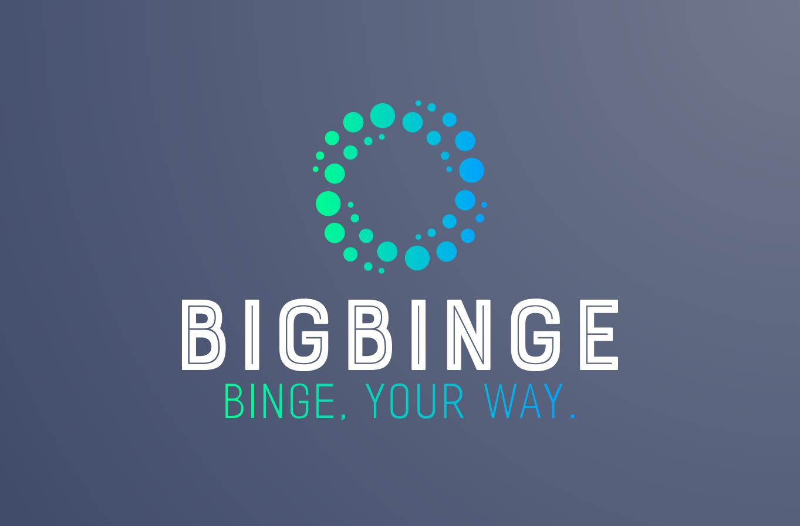

# BigBinge 🍿

## Overview

BigBinge is an interactive web application that helps you discover and explore TV shows based on your preferences. It offers a user-friendly interface, real-time search results, and the ability to save your favorite shows for future reference.

## Features

- 🎮 Customizable search options, including episode quantity, series rating, and genre.
- 📺 Real-time TV show search results with images and summaries.
- 💾 Save your favorite shows to local storage for easy access.
- 🌐 Responsive design for a seamless experience on various devices.

## Try It Out

Visit [BigBinge](https://bhansi.github.io/BigBinge/) and start discovering your next binge-worthy TV show!

## Technologies Used

- 🌐 HTML, CSS (with Tailwind CSS), and JavaScript.
- 🎥 [The Movie Database (TMDb) API](https://www.themoviedb.org/documentation/api) for TV show data.
- 🎥 [The YouTube API V3]
- [Lemondrop Font by Nymphont](https://www.fontspace.com/lemondrop-font-f13573)
- 🖼️ Icons from [FontAwesome](https://fontawesome.com/).

## Installation

1. Clone the GitHub repository to your local machine.
2. Open the `index.html` file in a web browser.

## Usage

1. Customize your TV show search preferences by selecting options for episode quantity, series rating, and genre.
2. Click the "Let's Binge" button to initiate the search.
3. Browse through TV show search results, including images and summaries.
4. Click on a TV show card to save it to your local storage for future reference.

## Deployed on GitHub Pages

BigBinge is deployed and accessible on [GitHub Pages](https://your-github-username.github.io/BigBinge/).

## Contribution

Contributions to BigBinge are welcome. Fork the repository, make your changes, and submit a pull request to improve the project.

## License

BigBinge is open-source and available under the [MIT License](LICENSE).

---

Feel free to explore BigBinge, customize your TV show search, and contribute to its development. If you encounter any issues or have suggestions for improvement, please let us know!
